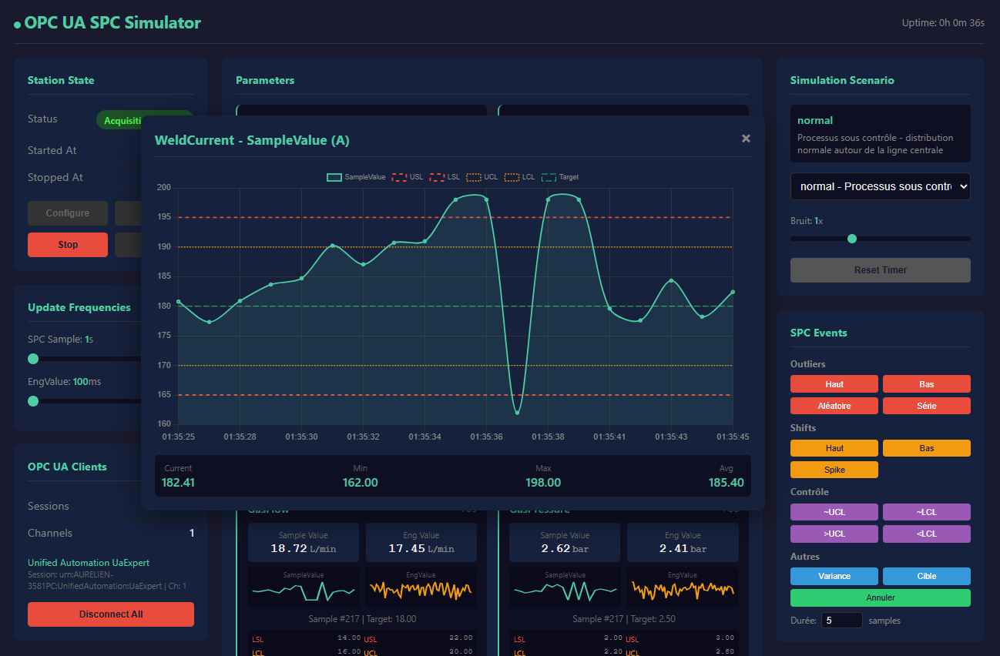

# OPC UA Control Chart Simulator

Simulateur OPC UA pour tester les cartes de contrôle SPC (Statistical Process Control) avec support de l'historisation et cache SQLite.

## Table des matières

- [Aperçu](#aperçu)
- [Fonctionnalités](#fonctionnalités)
- [Installation](#installation)
- [Démarrage rapide](#démarrage-rapide)
- [Options de ligne de commande](#options-de-ligne-de-commande)
- [Dashboard Web](#dashboard-web)
- [Machine d'état](#machine-détat)
- [Scénarios de simulation](#scénarios-de-simulation)
- [Injection d'événements SPC](#injection-dévénements-spc)
- [Connexion client OPC UA](#connexion-client-opc-ua)
- [Documentation détaillée](#documentation-détaillée)
- [Licence](#licence)

---

## Aperçu



Le simulateur OPC UA SPC génère des données de contrôle qualité réalistes pour tester les systèmes de cartes de contrôle. Il simule 24 paramètres de soudage avec historisation, injection d'événements, et un dashboard temps réel.

---

## Fonctionnalités

- **Serveur OPC UA** compatible avec la spécification MSP (namespace `http://opcua-simulators.local/UA/msp`)
- **24 paramètres de soudage** (P01 à P24) avec unités appropriées (A, V, °C, mm, bar, etc.)
- **Historisation** des valeurs SPC (`SampleValue`) avec cache SQLite
- **Machine d'état d'acquisition** conforme au XML NodeSet
- **10 scénarios de simulation** pour tester différentes situations de contrôle qualité
- **Fréquences séparées** : EngValue (100ms) et SPC samples (5s)
- **Dashboard web** temps réel avec sparklines, contrôle de la machine d'état, et injection d'événements
- **Gestion des clients OPC UA** avec possibilité de simuler une perte de communication
- **Persistance d'état** : l'état de la simulation est sauvegardé et restauré au redémarrage

---

## Installation

```bash
npm install
```

---

## Démarrage rapide

```bash
# Démarrage avec paramètres par défaut
npm run dev

# Avec options personnalisées
npm run dev -- --params 12 --scenario trend_up

# Compiler et exécuter
npm run build
npm start -- --params 24 --scenario realistic
```

Le serveur démarre sur `opc.tcp://localhost:4840` et le dashboard sur `http://localhost:3000`.

---

## Options de ligne de commande

| Option | Description | Défaut |
|--------|-------------|--------|
| `-P, --port <port>` | Port du serveur OPC UA | 4840 |
| `-p, --params <count>` | Nombre de paramètres activés (1-24) | 24 |
| `-s, --scenario <name>` | Scénario de simulation | realistic |
| `-f, --spc-frequency <ms>` | Fréquence des échantillons SPC | 5000 |
| `-e, --eng-frequency <ms>` | Fréquence de mise à jour EngValue | 100 |
| `-d, --db <path>` | Chemin de la base SQLite | ./data/cc_history.db |
| `-w, --dashboard-port <port>` | Port du dashboard web (0 pour désactiver) | 3000 |
| `-n, --namespace-index <index>` | Index du namespace | 2 |
| `--node-id-format <format>` | Format des NodeId: "string" ou "numeric" | string |
| `--list-scenarios` | Lister les scénarios disponibles | - |

---

## Dashboard Web

Le dashboard web temps réel est accessible sur `http://localhost:3000` et offre :

### Colonne gauche - Contrôles
- **État de la station** : Affiche l'état actuel avec boutons Configure, Start, Stop, Reset
- **Fréquences de mise à jour** : Sliders pour ajuster les fréquences SPC et EngValue
- **Clients OPC UA** : Liste des clients connectés avec bouton "Disconnect All" pour simuler une perte de communication

### Colonne centrale - Paramètres
- Cards pour chaque paramètre avec SampleValue, EngValue et sparklines
- Limites de tolérance (USL/LSL) et de contrôle (UCL/LCL)
- Clic sur une card pour graphique détaillé

### Colonne droite - Simulation
- Sélection et paramétrage du scénario actif
- Injection d'événements SPC (outliers, shifts, variance)

---

## Machine d'état

Le serveur implémente une machine d'état d'acquisition :

```
NotConfigured → Configure → Configuring → Idle → Start → AcquisitionStarted → Stop → AcquisitionStopped → Reset → Idle
```

| Code | État | Description |
|------|------|-------------|
| 0 | NotConfigured | État initial au démarrage |
| 1 | Idle | Prêt à démarrer l'acquisition |
| 2 | AcquisitionStarted | Acquisition en cours |
| 3 | AcquisitionStopped | Acquisition arrêtée |
| 8 | Configuring | Configuration en cours |
| 9 | ConfigurationError | Erreur de configuration |

---

## Scénarios de simulation

| Scénario | Description | Règle SPC testée |
|----------|-------------|------------------|
| `normal` | Processus sous contrôle | Aucune violation |
| `trend_up` | Dérive progressive vers le haut | Règle 2 (9 points consécutifs) |
| `trend_down` | Dérive progressive vers le bas | Règle 2 |
| `shift` | Décalage soudain de la moyenne | Règle 1 ou 2 |
| `cyclic` | Oscillation périodique | Pattern cyclique |
| `stratification` | Valeurs groupées près du centre | Faible variation |
| `mixture` | Distribution bimodale | Valeurs évitant le centre |
| `out_of_control` | Points occasionnels hors limites | Règle 1 (hors 3σ) |
| `increasing_variance` | Variance croissante | Processus instable |
| `realistic` | Combinaison d'effets réalistes | Simulation réaliste |

---

## Injection d'événements SPC

Le dashboard permet d'injecter des événements pour tester la détection d'anomalies :

| Type | Description |
|------|-------------|
| `outlier_high` / `outlier_low` | Valeur hors limites |
| `shift_up` / `shift_down` | Décalage de la moyenne |
| `trend_spike` | Pic soudain puis retour |
| `near_ucl` / `near_lcl` | Valeur proche des limites de contrôle |
| `above_ucl` / `below_lcl` | Valeur au-delà des limites de contrôle |
| `high_variance` | Augmentation de la variance |
| `at_target` | Retour à la valeur cible |

---

## Connexion client OPC UA

**Endpoint** : `opc.tcp://localhost:4840/UA/CCSimulator`

1. Connecter à l'endpoint
2. Écrire `true` sur `Station/Command/Configure` pour configurer
3. Écrire `true` sur `Station/Command/Start` pour démarrer l'acquisition
4. Parcourir `Objects/P01` pour voir les paramètres
5. Souscrire à `SampleValue` ou `EngValue` pour les valeurs en temps réel
6. Utiliser HistoryRead pour les données historiques de `SampleValue`

---

## Documentation détaillée

- **[Architecture du projet](docs/ARCHITECTURE.md)** : Structure des composants, flux de données, APIs
- **[Modèle de données OPC UA](docs/OPC-UA-DATAMODEL.md)** : Structure complète des nœuds, paramètres de soudage, historisation

---

## Licence

MIT
