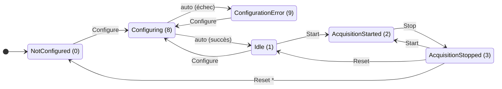

# Modèle de données OPC UA

Ce document décrit la structure des nœuds OPC UA exposés par les stations d'acquisition SPC.

## Révisions

| Version | Date | Auteur | Description |
|---------|------|--------|-------------|
| 1.0 | 2026-01-06 | A. Michon | Création initiale |
| 1.1 | 2026-02-13 | A. Michon | Heartbeat/HeartbeatAck UInt64, machine d'état, transition Reset optionnelle |
| 1.2 | 2026-02-13 | A. Michon | Qualité des données (StatusCode), compteurs de diagnostic |
| 1.3 | 2026-02-25 | A. Michon | Simplification des seuils de déclenchement/arrêt : remplacement des 4 seuils min/max par 2 seuils uniques |

> **Note :** Les versions 1.0 à 1.3 concernent ce document. La version **v1.8** fait référence au **NodeSet OPC UA** (`Opc.Ua.CC.NodeSet_v1.8.xml`) qui remplace le v1.7.

## Références

| Document | Description |
|----------|-------------|
| `Opc.Ua.CC.NodeSet_v1.8.xml` | Définition formelle du NodeSet OPC UA (namespace CC), généré par SiOME |
| OPC UA 1.05.03 | Spécification OPC Foundation requise par le modèle |

## Namespace

| Propriété | Valeur |
|-----------|--------|
| URI | `http://framatome.com/UA/msp` |
| Version du modèle | 1.0 |
| Date de publication | 2025-05-12 |
| Modèle OPC UA requis | OPC UA 1.05.03 (2023-12-15) |
| Générateur | SiOME Standard 3.0.2 |
| Index namespace (simulateur) | 2 (configurable via `--namespace-index`) |

## Format des NodeId

Le NodeSet utilise des NodeId numériques dans le namespace `ns=1` :
```
ns=1;i=6207   (Station.Heartbeat)
ns=1;i=6208   (Station.HeartbeatAck)
```

Le simulateur expose les nœuds par défaut au format string dans le namespace configuré :
```
ns=2;s=Station.Name
ns=2;s=P01.SampleValue
```

Format numérique disponible via `--node-id-format numeric` :
```
ns=2;i=6000
ns=2;i=6001
```

## Structure complète

```
Objects/
├── Station/
│   ├── Name                   (String)
│   ├── SerialNumber           (String)
│   ├── Manufacturer           (String)
│   ├── Heartbeat              (UInt64)
│   ├── HeartbeatAck           (UInt64)
│   ├── State/
│   │   ├── Value              (UInt16)
│   │   ├── StartedAt          (DateTime)
│   │   └── StoppedAt          (DateTime)
│   ├── Command/
│   │   ├── Configure          (Boolean)
│   │   ├── Start              (Boolean)
│   │   ├── Stop               (Boolean)
│   │   └── Reset              (Boolean)
│   ├── Config/
│   │   ├── StartCondition/
│   │   │   ├── Type           (UInt16)
│   │   │   ├── ParameterIndex (UInt32)
│   │   │   ├── Threshold      (Double)
│   │   │   ├── Hysteresis     (Double)
│   │   │   └── TimeDelay      (Double)
│   │   └── StopCondition/
│   │       ├── Type           (UInt16)
│   │       ├── ParameterIndex (UInt32)
│   │       ├── Threshold      (Double)
│   │       ├── Hysteresis     (Double)
│   │       └── TimeDelay      (Double)
│   ├── Metrics/
│   │   ├── CycleTime              (UInt32)
│   │   ├── ConnectionLossCount    (UInt32)
│   │   ├── Info1                  (Double)
│   │   ├── Info2                  (Double)
│   │   ├── LastConnectionLossAt   (DateTime)
│   │   ├── StartupTime            (DateTime)
│   │   ├── StorageFillPercentage  (Double)
│   │   └── UpTimeSeconds          (UInt32)
│   └── Context/
│       ├── DoubleInfo1            (Double)
│       ├── DoubleInfo2            (Double)
│       ├── DoubleInfo3            (Double)
│       ├── OperationId            (String)
│       ├── ProductionOrderId      (String)
│       ├── RoutingId              (String)
│       ├── SpecDouble1            (Double)
│       ├── SpecDouble2            (Double)
│       ├── SpecDouble3            (Double)
│       ├── SpecString1            (String)
│       ├── SpecString2            (String)
│       └── SpecString3            (String)
├── P01/
│   ├── SampleValue            (Double) ← Historisé
│   ├── EngValue               (Double)
│   ├── SampleIndex            (UInt32)
│   ├── Name                   (String)
│   ├── ParameterIndex         (UInt32)
│   ├── Enabled                (Boolean)
│   ├── PhysicalUnit           (String)
│   └── Config/
│       ├── EngRange/
│       │   ├── MinimumValue   (Double)
│       │   └── MaximumValue   (Double)
│       ├── Processing/
│       │   ├── Function       (UInt16)
│       │   └── WindowSize     (UInt32)
│       ├── ProcessingFilter/
│       │   ├── FilterType     (Int16)
│       │   ├── Order          (Int16)
│       │   ├── LowCut         (Double)
│       │   ├── HighCut        (Double)
│       │   └── BandType       (Int16)
│       └── SampleRate         (UInt32)
├── P02/ ... P24/
│   └── (même structure que P01)
```

## Détail des nœuds

### Station

| Nœud | Type | Accès | Description |
|------|------|-------|-------------|
| `Station.Name` | String | R | Nom de la station |
| `Station.SerialNumber` | String | R | Numéro de série |
| `Station.Manufacturer` | String | R | Fabricant |
| `Station.Heartbeat` | UInt64 | RW | Bit de vie - écriture client |
| `Station.HeartbeatAck` | UInt64 | R | Recopie automatique du Heartbeat |

### Commandes

| Nœud | Type | Accès | Action |
|------|------|-------|--------|
| `Station.Command.Configure` | Boolean | RW | Écrire `true` pour configurer |
| `Station.Command.Start` | Boolean | RW | Écrire `true` pour démarrer |
| `Station.Command.Stop` | Boolean | RW | Écrire `true` pour arrêter |
| `Station.Command.Reset` | Boolean | RW | Écrire `true` pour réinitialiser |

### Configuration des conditions d'acquisition

Chaque condition (démarrage et arrêt) est une instance du type `CCTriggerCondition` défini dans le NodeSet XML (`Opc.Ua.CC.NodeSet_v1.8.xml`).

#### Nœuds

| Nœud | Type | Accès | Description |
|------|------|-------|-------------|
| `Station.Config.StartCondition.Type` | UInt16 | RW | Type de déclenchement : 0 = manuel (commande OPC UA), 1 = auto sur seuil (voir CCTriggerTypeEnum) |
| `Station.Config.StartCondition.ParameterIndex` | UInt32 | RW | Index du paramètre surveillé (P01=1, P02=2, …) |
| `Station.Config.StartCondition.Threshold` | Double | RW | Seuil de déclenchement de l'acquisition |
| `Station.Config.StartCondition.Hysteresis` | Double | RW | Hystérésis appliquée au seuil de déclenchement |
| `Station.Config.StartCondition.TimeDelay` | Double | RW | Délai (s) avant déclenchement effectif |
| `Station.Config.StopCondition.Type` | UInt16 | RW | Type de déclenchement : 0 = manuel (commande OPC UA), 1 = auto sur seuil (voir CCTriggerTypeEnum) |
| `Station.Config.StopCondition.ParameterIndex` | UInt32 | RW | Index du paramètre surveillé |
| `Station.Config.StopCondition.Threshold` | Double | RW | Seuil d'arrêt de l'acquisition |
| `Station.Config.StopCondition.Hysteresis` | Double | RW | Hystérésis appliquée au seuil d'arrêt |
| `Station.Config.StopCondition.TimeDelay` | Double | RW | Délai (s) avant arrêt effectif |

#### CCTriggerTypeEnum

| Valeur | Nom | Description |
|--------|-----|-------------|
| 0 | UaCommand | Déclenchement manuel par commande OPC UA (Start/Stop) |
| 1 | Threshold | Déclenchement automatique sur franchissement de seuil |

#### Évolution v1.8 : simplification des seuils

Le NodeSet XML v1.7 définissait 2 bornes par condition : `LowerLimit` et `UpperLimit`, soit 4 seuils au total. Cette approche a été abandonnée car :

- Le Datalogger n'utilise réellement que 2 seuils sur les 4 (LowerLimit du déclenchement et UpperLimit de l'arrêt)
- Configurer 4 seuils prête à confusion et génère des erreurs de configuration évitables
- Rien n'empêche un opérateur de configurer une borne basse à 0, ce qui provoque un enregistrement en continu (valeur résiduelle sur la mesure de courant même hors soudage)

**Le modèle v1.8 remplace `LowerLimit` + `UpperLimit` par un unique `Threshold` par condition :**

| Ancien (XML v1.7) | Nouveau (v1.8) | Rôle |
|--------------------|----------------|------|
| `StartCondition.LowerLimit` | `StartCondition.Threshold` | Seuil au-dessus duquel l'acquisition démarre |
| `StartCondition.UpperLimit` | *(supprimé)* | — |
| `StopCondition.LowerLimit` | *(supprimé)* | — |
| `StopCondition.UpperLimit` | `StopCondition.Threshold` | Seuil en dessous duquel l'acquisition s'arrête |

> `Hysteresis` et `TimeDelay` sont conservés sans modification.

#### Règle de validation des seuils

```
StartCondition.Threshold >= StopCondition.Threshold
```

Si cette contrainte n'est pas respectée lors de la commande `Configure`, la station passe en état `ConfigurationError` (code 9). Cette règle empêche le Datalogger de boucler indéfiniment (démarrage puis arrêt immédiat si la mesure oscille entre les deux seuils).

**Exemples :**

| Threshold déclenchement | Threshold arrêt | Résultat |
|------------------------|-----------------|----------|
| 60 A | 50 A | OK — l'acquisition démarre au-dessus de 60 A et s'arrête en dessous de 50 A |
| 50 A | 50 A | OK — seuils identiques (pas d'hystérésis) |
| **50 A** | **60 A** | **ConfigurationError** — le seuil de déclenchement est inférieur au seuil d'arrêt |

### Métriques

| Nœud | Type | Accès | Description |
|------|------|-------|-------------|
| `Station.Metrics.CycleTime` | UInt32 | R | Temps de cycle en ms |
| `Station.Metrics.ConnectionLossCount` | UInt32 | R | Nombre de pertes de connexion détectées |
| `Station.Metrics.Info1` | Double | R | Information 1 |
| `Station.Metrics.Info2` | Double | R | Information 2 |
| `Station.Metrics.LastConnectionLossAt` | DateTime | R | Timestamp dernière perte de connexion |
| `Station.Metrics.StartupTime` | DateTime | R | Timestamp démarrage serveur |
| `Station.Metrics.StorageFillPercentage` | Double | R | % remplissage stockage |
| `Station.Metrics.UpTimeSeconds` | UInt32 | R | Uptime en secondes |

### Contexte

| Nœud | Type | Accès | Description |
|------|------|-------|-------------|
| `Station.Context.OperationId` | String | RW | ID opération |
| `Station.Context.ProductionOrderId` | String | RW | ID ordre de production |
| `Station.Context.RoutingId` | String | RW | ID routage |
| `Station.Context.DoubleInfo1` | Double | R | Information numérique 1 |
| `Station.Context.DoubleInfo2` | Double | RW | Information numérique 2 |
| `Station.Context.DoubleInfo3` | Double | RW | Information numérique 3 |
| `Station.Context.SpecDouble1/2/3` | Double | RW | Spécifications numériques |
| `Station.Context.SpecString1/2/3` | String | RW | Spécifications textuelles |

### Paramètres (P01-P24)

| Nœud | Type | Accès | Description |
|------|------|-------|-------------|
| `Pxx.SampleValue` | Double | R | Valeur SPC **historisée** |
| `Pxx.EngValue` | Double | R | Valeur temps réel |
| `Pxx.SampleIndex` | UInt32 | R | Index de l'échantillon |
| `Pxx.Name` | String | R | Nom technique |
| `Pxx.ParameterIndex` | UInt32 | R | Index du paramètre |
| `Pxx.Enabled` | Boolean | R | Paramètre actif |
| `Pxx.PhysicalUnit` | String | R | Unité de mesure |

### Configuration paramètre

| Nœud | Type | Accès | Description |
|------|------|-------|-------------|
| `Pxx.Config.EngRange.MinimumValue` | Double | R | LSL (limite basse de tolérance) |
| `Pxx.Config.EngRange.MaximumValue` | Double | R | USL (limite haute de tolérance) |
| `Pxx.Config.Processing.Function` | UInt16 | R | 0=None, 1=Average, 2=MovingAverage |
| `Pxx.Config.Processing.WindowSize` | UInt32 | R | Taille fenêtre traitement |
| `Pxx.Config.ProcessingFilter.FilterType` | Int16 | R | Type de filtre |
| `Pxx.Config.ProcessingFilter.Order` | Int16 | R | Ordre du filtre |
| `Pxx.Config.ProcessingFilter.LowCut` | Double | R | Fréquence de coupure basse |
| `Pxx.Config.ProcessingFilter.HighCut` | Double | R | Fréquence de coupure haute |
| `Pxx.Config.ProcessingFilter.BandType` | Int16 | R | Type de bande |
| `Pxx.Config.SampleRate` | UInt32 | R | Fréquence d'échantillonnage (ms) |

### Historisation

Seul `Pxx.SampleValue` est historisé via le service OPC UA **HistoryRead**.

Exemple de requête :
- NodeId : `ns=2;s=P01.SampleValue`
- StartTime : `2026-01-06T00:00:00Z`
- EndTime : `2026-01-07T00:00:00Z`

## Qualité des données

### Principe

La qualité OPC UA (StatusCode) est portée par chaque valeur de paramètre. Elle s'applique en premier lieu sur la donnée source non moyennée `Pxx.EngValue` (valeur temps réel issue du capteur) et est **répliquée** sur l'échantillon calculé `Pxx.SampleValue` (valeur SPC historisée).

La qualité ne doit pas être systématiquement `Good` : elle reflète l'état réel du capteur et de la chaîne d'acquisition. Un client OPC UA doit exploiter le StatusCode pour qualifier la fiabilité des mesures avant tout traitement statistique.

### Propagation de la qualité

```
Capteur → EngValue (StatusCode source) → traitement → SampleValue (StatusCode répliqué)
```

| Nœud | Rôle qualité |
|------|-------------|
| `Pxx.EngValue` | **Source** — qualité déterminée par l'état du capteur |
| `Pxx.SampleValue` | **Réplique** — reprend le StatusCode de `EngValue` au moment du calcul de l'échantillon |

Si `EngValue` porte un StatusCode `Bad_*` au moment de l'échantillonnage, le `SampleValue` correspondant est également marqué `Bad` avec le même code. Les données historisées via HistoryRead conservent le StatusCode de chaque échantillon.

### Codes de qualité applicables

Les StatusCode suivants s'appliquent aux mesures capteur (`EngValue` / `SampleValue`). La qualité des mesures ne couvre pas les aspects réseau (perte de connexion OPC UA) — ces aspects sont traités par les compteurs de diagnostic.

| StatusCode | Code hex | Description | Cas d'usage |
|------------|----------|-------------|-------------|
| `Good` | `0x00000000` | Valeur fiable | Fonctionnement nominal |
| `Bad_SensorFailure` | `0x80690000` | Défaillance capteur | Capteur HS, signal absent |
| `Bad_DeviceFailure` | `0x806B0000` | Défaillance équipement | Panne du conditionneur de signal |
| `Bad_OutOfService` | `0x808D0000` | Hors service | Capteur désactivé volontairement |
| `Bad_NotConnected` | `0x808A0000` | Non connecté | Capteur physiquement déconnecté |
| `Bad_NoCommunication` | `0x80310000` | Pas de communication | Bus de terrain en erreur |
| `Bad_ConfigurationError` | `0x80890000` | Erreur de configuration | Paramétrage capteur incohérent |
| `Bad_WaitingForInitialData` | `0x80320000` | En attente de données | Démarrage, pas encore de mesure |
| `Bad_OutOfRange` | `0x803C0000` | Hors plage | Valeur hors limites physiques du capteur |

### Compteurs de diagnostic

La qualité des mesures ne reflète pas les problèmes de communication réseau OPC UA. Pour le suivi des pertes de connexion et autres événements réseau, des compteurs de diagnostic sont exposés dans le modèle :

| Nœud | Type | Accès | Description |
|------|------|-------|-------------|
| `Station.Metrics.ConnectionLossCount` | UInt32 | R | Nombre de pertes de connexion détectées |
| `Station.Metrics.LastConnectionLossAt` | DateTime | R | Timestamp de la dernière perte de connexion |

Ces compteurs permettent au système superviseur de surveiller la fiabilité de la liaison sans polluer le StatusCode des mesures avec des informations réseau.

## Machine d'état d'acquisition

### États

| Code | Nom | Description |
|------|-----|-------------|
| 0 | NotConfigured | État initial au démarrage |
| 8 | Configuring | Configuration en cours (transitoire) |
| 9 | ConfigurationError | Erreur de configuration |
| 1 | Idle | Configuré, prêt à démarrer |
| 2 | AcquisitionStarted | Acquisition en cours |
| 3 | AcquisitionStopped | Acquisition arrêtée |

### Nœuds associés

| Nœud | Type | Accès | Description |
|------|------|-------|-------------|
| `Station.State.Value` | UInt16 | R | Code d'état courant |
| `Station.State.StartedAt` | DateTime | R | Timestamp de démarrage de l'acquisition |
| `Station.State.StoppedAt` | DateTime | R | Timestamp d'arrêt de l'acquisition |

### Diagramme de transitions



> \* La transition Stopped → NotConfigured via Reset est optionnelle (mode `resetToNotConfigured`).

### Transitions valides

| État source | Commande | État cible | Notes |
|-------------|----------|------------|-------|
| NotConfigured | Configure | Configuring | Premier démarrage |
| Configuring | *(auto)* | Idle | Configuration réussie |
| Configuring | *(auto)* | ConfigurationError | Échec de configuration |
| ConfigurationError | Configure | Configuring | Nouvelle tentative |
| Idle | Start | AcquisitionStarted | Lancement acquisition |
| Idle | Configure | Configuring | Reconfiguration |
| AcquisitionStarted | Stop | AcquisitionStopped | Arrêt acquisition |
| AcquisitionStopped | Reset | Idle | Réinitialisation |
| AcquisitionStopped | Start | AcquisitionStarted | Redémarrage direct |
| AcquisitionStopped | Reset | NotConfigured | Déconfiguration (mode optionnel) |

### Workflow typique

```
Configure → (auto) → Start → ... → Stop → Reset → Start → ...
```

1. Écrire `true` sur `Station.Command.Configure`
2. La station passe en `Configuring` puis automatiquement en `Idle`
3. Écrire `true` sur `Station.Command.Start` pour démarrer l'acquisition
4. Écrire `true` sur `Station.Command.Stop` pour arrêter
5. Écrire `true` sur `Station.Command.Reset` pour revenir en `Idle`
6. Ou écrire `true` sur `Station.Command.Start` pour redémarrer directement
